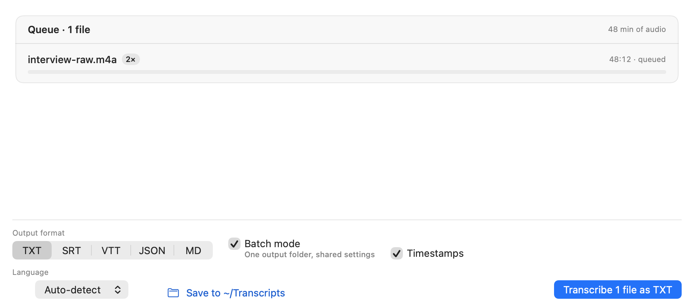
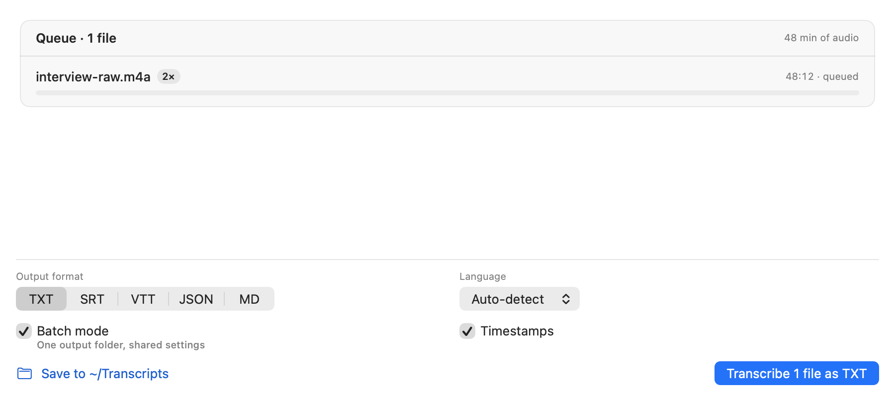
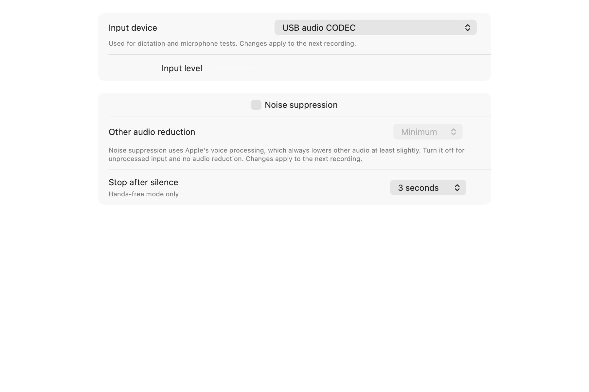
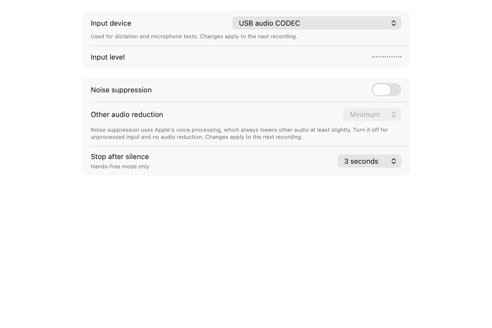
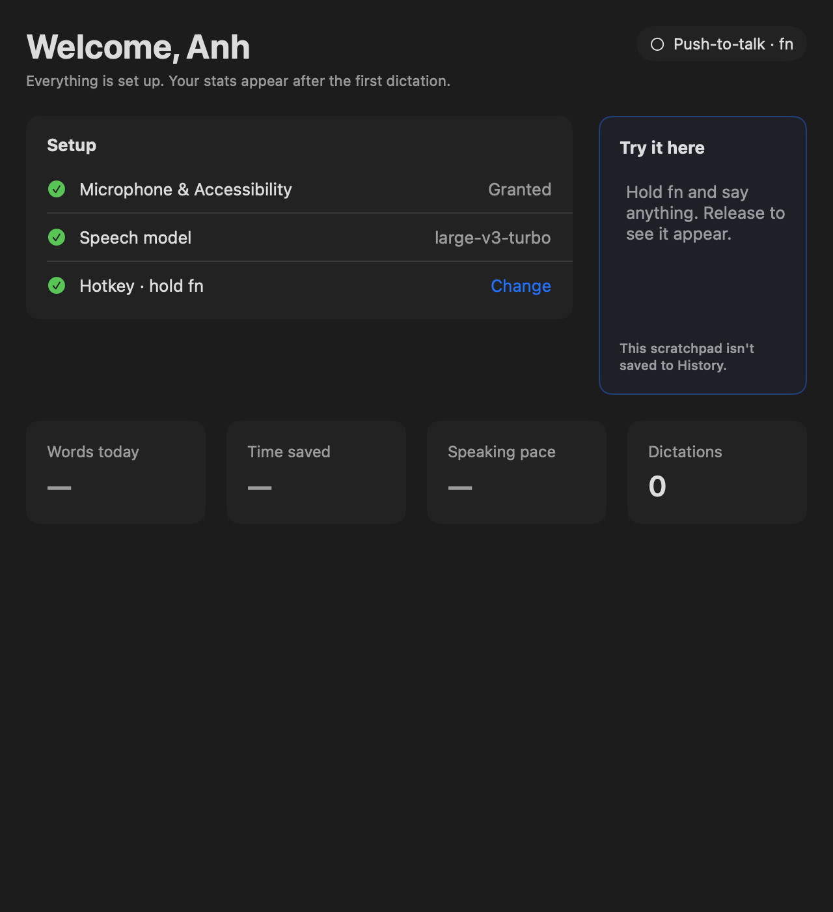
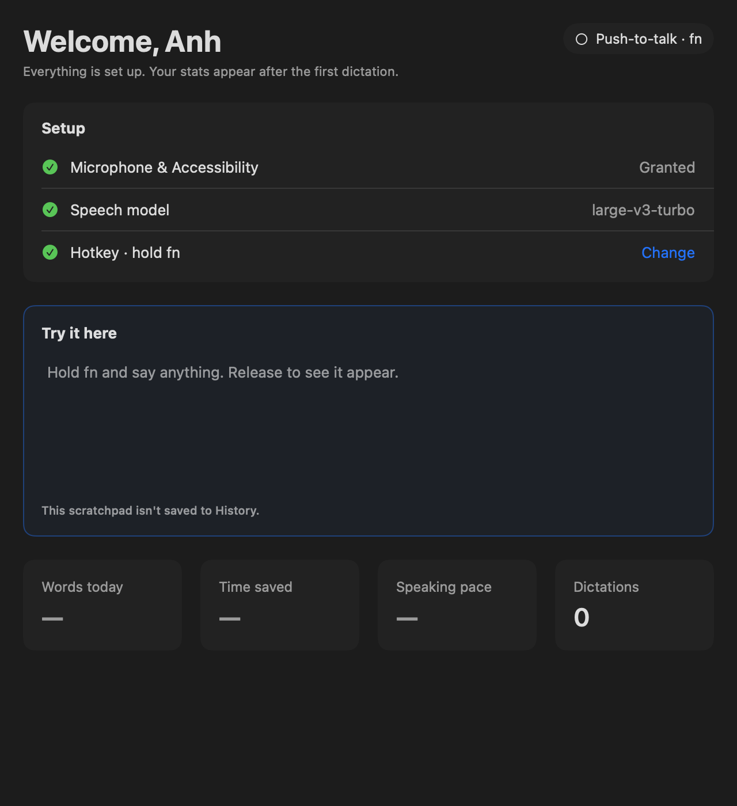

# Alignment audit — 2026-09-12

The owner reported drifting controls in Files and Audio. Fresh captures reproduced both defects.
Existing layouts were corrected; no product behavior or data model was changed.

## Steps and results

| Step | Surface | Result and evidence |
| --- | --- | --- |
| 1 | Files queue controls and transcript results | Fixed mixed control baselines and the indented Language menu. Format/language now share a two-column grid; checkboxes share a baseline; folder/action share a centerline. All formats and result/error states remain contained at 640/900 pt detail widths. [Before](01-files-before.png), [after](01-files-after.png). |
| 2 | Settings: Audio, General, Privacy, Hotkeys, Models | Fixed Audio labels, trailing controls and light-theme meter visibility; General/Privacy menus now share their trailing edge. Native selected/unavailable states and narrow light/dark settings captures reviewed. [Audio before](02-audio-before.png), [after](02-audio-after.png), [General](02-general-after.png). |
| 3 | Home | At 640 pt detail width, the fixed Setup column squeezed the scratchpad to about 160 pt. The pair now stacks when both cannot fit; regular width retains two columns. The same native scratchpad and its text survive resizing in both directions. [Before](03-home-before.png), [after](03-home-after.png). |
| 4 | History | List, expanded/editing states, long headers and filters reviewed; no additional alignment defect confirmed in the captured states. [List](04-history.png). |
| 5 | Dictionary | Native table, sheets and contacts controls reviewed; column anchors remain consistent. Replaced the fixture's ImageRenderer path so native controls are visible. [List](05-dictionary.png). |
| 6 | Snippets | Fixed vertically centered cards: each row now starts at a shared top edge while preserving natural card height. Narrow copy wraps within cards. [After](06-snippets-after.png). |
| 7 | Styles | Cards now share the tallest card's natural height; all descriptions wrap without fixed-height clipping. [After](07-styles-after.png). |
| 8 | MCP, onboarding and sidebar | Native MCP controls reviewed after removing unsupported-control placeholders from its fixture; onboarding light/dark states and extreme sidebar byte counts reviewed. No additional alignment defect confirmed. [MCP](08-mcp.png). |
| 9 | Flow Bar | Fresh listening and processing captures remain aligned and contained; waveform styling defaults are preserved. [Listening](09-flowbar-listening.png), [processing](09-flowbar-processing.png). |

## Before/after examples

### 1. Files

### 2. Audio

### 3. Narrow Home

## Validation and limits

- The real native resize regression first failed on lost text/editor identity, then passed after preserving one editor and measuring the viewport without imposing a conflicting native minimum width.
- Fresh baseline render pass: 32 test cases; correction render pass: 12 cases; final Home/resize/lifecycle/Flow Bar pass: 28 cases. All passed with complete-log and structured-xcresult warning gates clean.
- Baseline saved 121 captures, review saved 130; changed surfaces received direct before/after inspection and independent review. Screenshots use disposable fixture data.
- Narrow layout checks use 640 pt detail content: the app supports a 900 pt minimum window with a 200–260 pt sidebar. Regular detail checks use 900 pt. No unsupported smaller window size is promised.
- Native AppKit-hosted views capture real controls offscreen. Some unchanged historical render fixtures still show component content rather than the entire navigation/window chrome; their outer centering is not treated as a production spacing defect.
- This is a visual alignment/overflow review of the listed states, not exhaustive accessibility certification, VoiceOver testing, every possible user string, or every transient interaction.
- Reproduce with `TEST_RUNNER_VOXFLOW_RENDER=1` and the affected render suites; local logs are `/tmp/voxflow-alignment-{before,review}.{log,json,xcresult}` and `/tmp/voxflow-home-alignment-accepted.{log,json,xcresult}`. No full-suite or CI iteration was used for local layout development.
