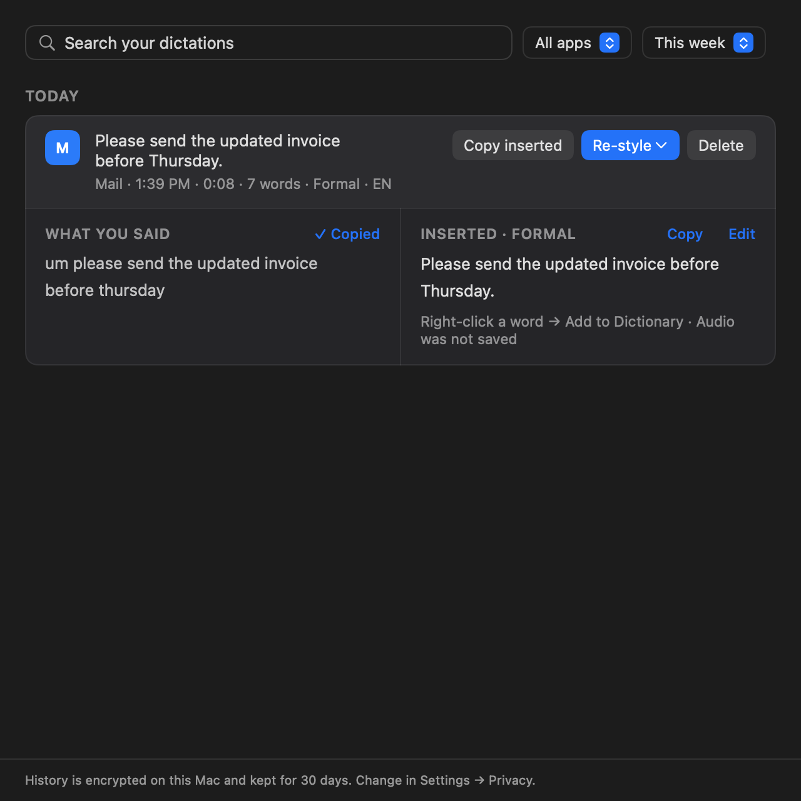
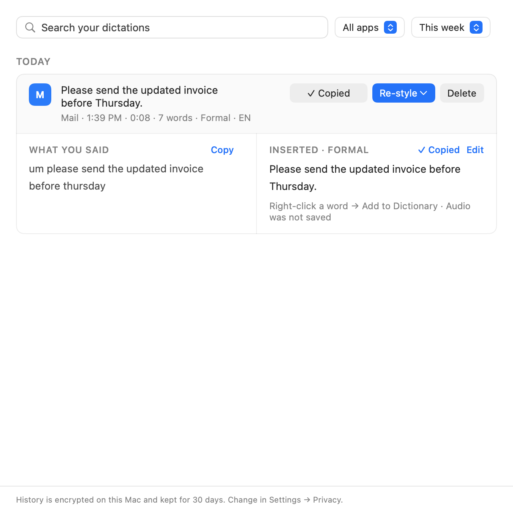

# History copy actions

The row action is explicitly **Copy inserted** (saved processed/edited text). Both expanded
columns have their own **Copy** button: WHAT YOU SAID copies rawText; INSERTED copies text.
**✓ Copied** lasts two seconds, with matching feedback on both inserted-text buttons. Copying
another source replaces the old receipt; repeated copies restart the timer without shifting layout.

Inserted copy is disabled during an unsaved edit; save or cancel first. Original copy remains
available. Unreadable and empty sources cannot be copied. Feedback is keyed to the payload,
so changed text cannot display an old confirmation.

Local validation: 56 passed, 1 intentionally skipped manual popover case. Covers exact pasteboard
payloads, source/record identity, expiry/restart, model lifetime, invalid sources, edit restrictions,
and the previous History native layout regression. Tests use a fake pasteboard and clock.
Full-log and structured xcresult warning gates passed. All four 640 pt theme/source captures
were inspected. Evidence: `/tmp/voxflow-history-copy-{red3,green}.{log,xcresult}`.

