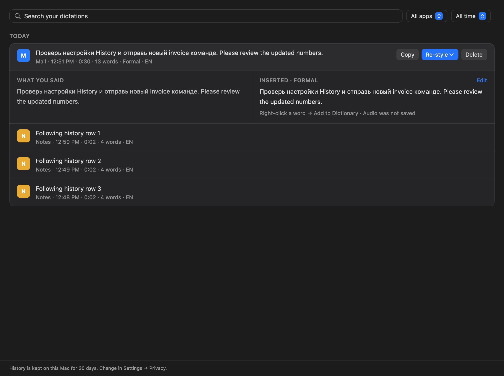
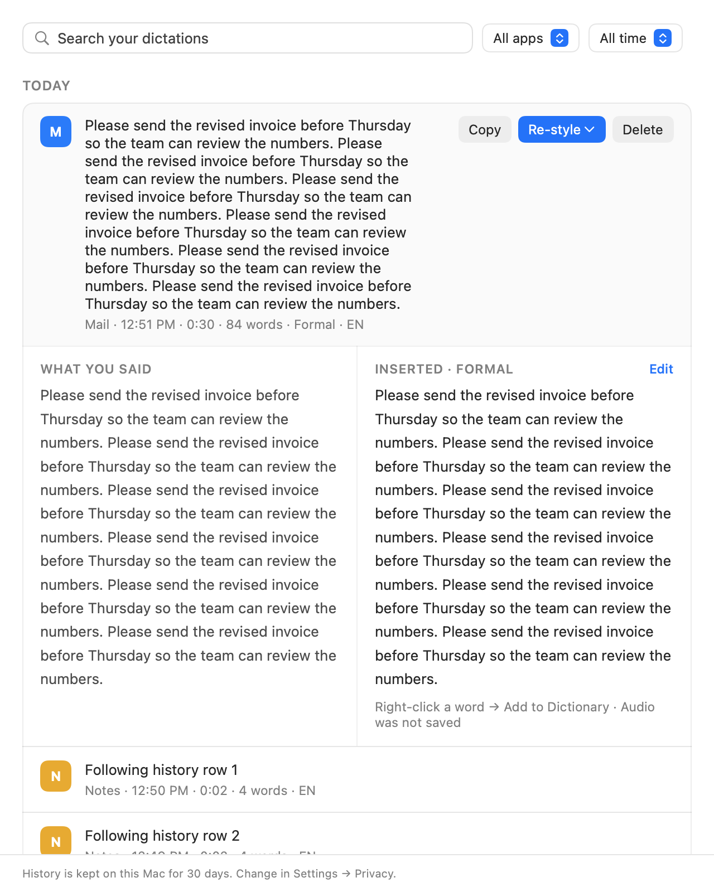

# History transcript layout regression

The owner reported inserted text wrapping into a narrow strip and overflowing following records.
`TranscriptWordView.sizeThatFits` mutated the live text container during speculative SwiftUI sizing.
Measurement now uses an independent TextKit layout and ignores non-finite width proposals.

A native SwiftUI layout regression failed before the fix with a 400 pt text view whose live
container had an infinite width, then passed after the fix. The exact narrow-strip screenshot
was not reproduced automatically; this check establishes the underlying measurement side effect.

Production HistoryPageBody captures and geometry checks cover short bilingual and long records,
light/dark themes, and 1073 → 640 → 1073 → 900 pt resizing. Glyphs fit the native view and its
SwiftUI allocation; the footer and following rows were visually checked. Dictionary context-menu
and inline editing checks remain successful.

Targeted validation: 19 passed, 1 intentionally skipped manual popover test; full-log and
structured xcresult warning gates passed. Evidence: `/tmp/voxflow-history-layout-{red4,green}`
logs and result bundles. All screenshots use disposable fixture data.

