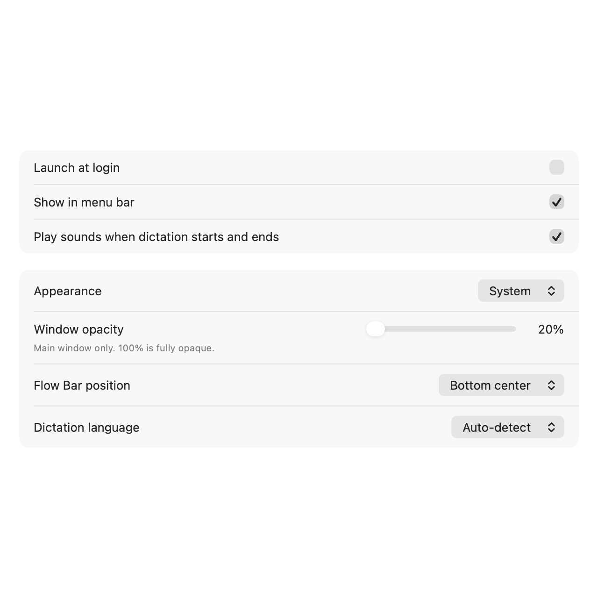
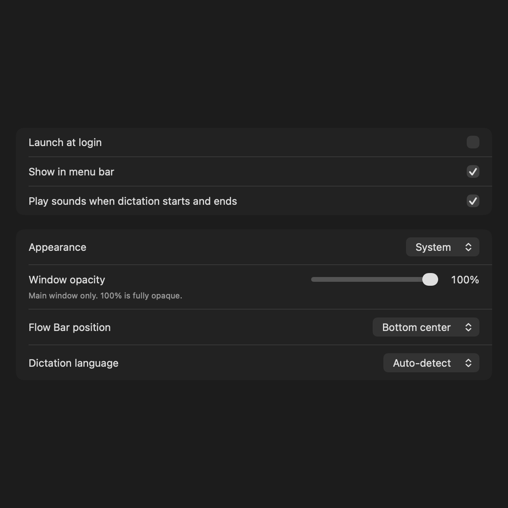

# Window opacity — #243

Settings → General → Window opacity, below Appearance: drag from 20% to 100%.
100% is fully opaque. The setting applies immediately to the main window and persists.

Native validation passed: stored defaults, reloads, invalid values, live NSWindow alpha changes,
reattaching the same host, recreating a host with reloaded settings, and isolation from other panels.
The window test failed with the adapter disabled and passed after enabling it.
16 targeted cases passed; the final smooth-slider render pass (2 cases) and both warning gates passed.

The screenshots show native settings content at 640 pt in both themes, rather than composited
window transparency. Actual window alpha is verified by WindowOpacityBridgeTests.

